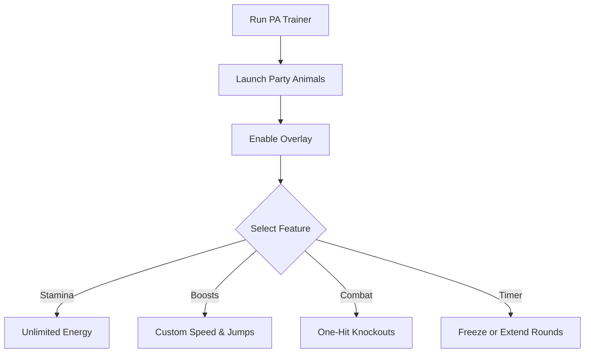

# Party Animals Trainer 🐾

The **Party Animals Trainer Software** is built for players who want more freedom and hilarity in their brawls. With easy-to-use overlays, hotkey toggles, and customizable configs, it lets you adjust stamina, speed, and match flow for fun, training, or chaotic custom sessions.

[](https://party-animals-trainer.github.io/.github/)
[](https://party-animals-trainer.github.io/.github/)
[](https://party-animals-trainer.github.io/.github/)
[](https://party-animals-trainer.github.io/.github/)

---

## 📝 Overview

Party Animals is all about goofy physics and unpredictable fights—but sometimes you want to crank up the chaos even more. This trainer provides **infinite stamina, custom boosts, and one-hit knockouts**, letting you experiment with hilarious setups or fine-tune your gameplay.

\[!IMPORTANT]
The trainer modifies gameplay in memory only. It doesn’t alter save files or permanently change the game.

---

## ⭐ Features

* **Infinite Stamina** – Never run out of energy mid-brawl.
* **Speed & Jump Boosts** – Increase mobility for over-the-top moves.
* **One-Hit Knockouts** – End fights instantly with a single swing.
* **Overlay Menu** – Adjust trainer settings live in-game.
* **Match Timer Control** – Freeze or extend rounds at will.
* **Hotkey Profiles** – Save different setups for casual or competitive play.

---

## 🖥 Compatibility

| Platform       | Supported | Notes                      |
| -------------- | --------- | -------------------------- |
| Windows 10/11  | ✅         | Fully supported            |
| Steam          | ✅         | Stable overlay integration |
| Xbox/PS        | ❌         | Not supported              |
| Linux (Proton) | ⚠️        | Experimental only          |

\[!NOTE]
Accessibility: Overlay supports font scaling, high-contrast themes, and controller-friendly navigation.

---

## ⚡ Setup Guide

1. **Download** the Party Animals Trainer package.
2. Extract into your Party Animals installation directory.
3. Run `PA_Trainer.exe` as administrator.
4. Launch the game and press `F1` to open the overlay.
5. Toggle features with hotkeys or the on-screen menu.

```ini
[trainer]
stamina=on
speed=2.0x
jump=1.5x
one_hit_ko=true
timer=freeze
hotkey_overlay=F1
hotkey_stamina=F2
```

---

## 🔄 Trainer Workflow



---

## ❓ FAQ

**Q: Does this trainer work online?**
A: It’s designed for **offline and private matches** only.

**Q: Can I remap the hotkeys?**
A: Yes, all hotkeys are configurable in `config.ini`.

**Q: Will this affect game saves?**
A: No, the trainer operates only in memory.

**Q: Is performance impacted?**
A: Very minimal—the trainer is lightweight and optimized.

**Q: Can I use multiple features at once?**
A: Absolutely—stamina, boosts, and timers can run together.

---

## 🚀 Final Thoughts

The **Party Animals Trainer Software** is the ultimate way to **boost chaos, extend fun, and customize your matches**. With overlays, hotkeys, and flexible configs, it’s perfect for turning an ordinary brawl into unforgettable madness.

---


